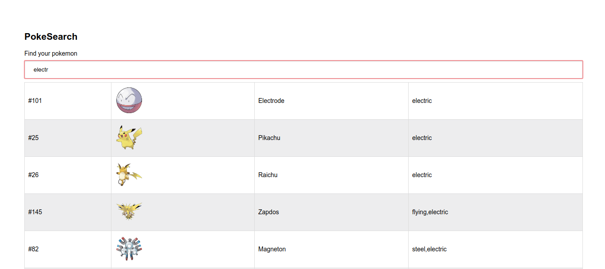
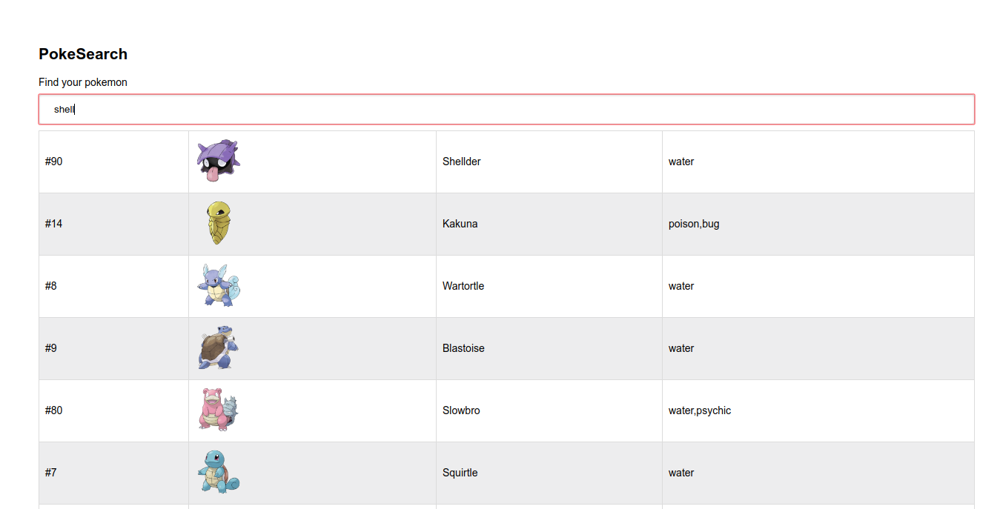

# PokeSearch

Simple NodeJS + Express + Elasticsearch app to search Pokemons

On startup, NodeJS will load a JSON with all pokemons and will index them on bulk in elasticsearch.

Then you can search Pokemon by names, descriptions or types simultaneously.

Over the mouse to see the description for the Pokemon.

Minimal frontend with JQuery to display the Pokemons.

## Run the server 

First you need to run the elasticsearch server `docker-compose up elasticsearch`

Then you can run the server by doing 

    npm start 

You can also run it with docker, but change the elasticsearch endpoint from `localhost` to `elasticsearch` on `elasticsearch/pokemon.js` then run 

    docker-compose up pokesearch

## Run the tests

There are a few integration tests to check the response from the API

    npm test
